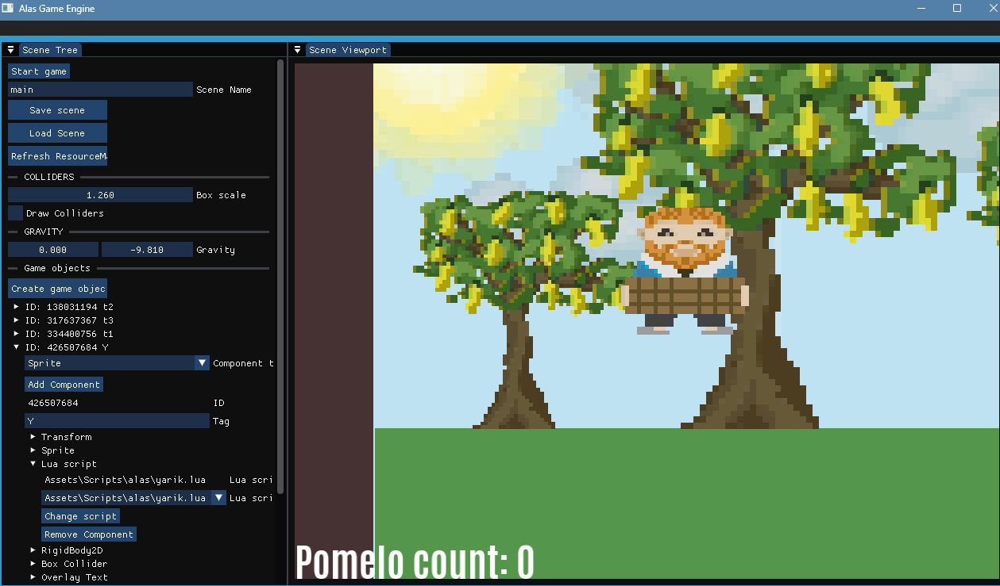
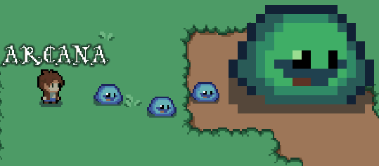
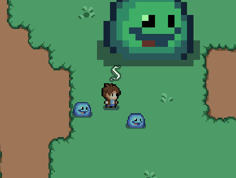
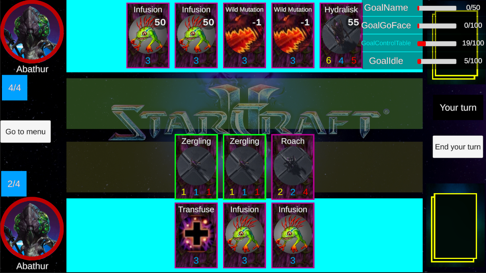
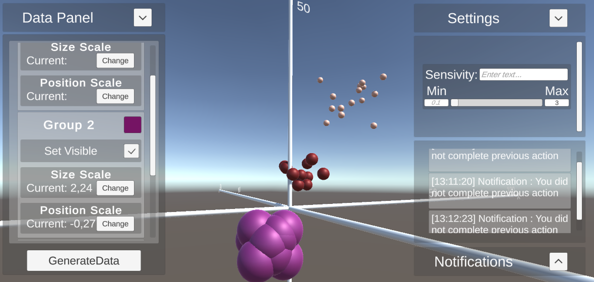

# Gamedev Portfolio
**Lobanov Vladimir (Sssssaber)** — Gameplay programmer and prototype developer specializing in Unity and C++.

## Key Skills
- **Design Patterns**: Abstract Factory, State, GOAP ([Alas-game-engine](https://github.com/Ssssssaber/Alas-game-engine), [Starcraft-Card-Game](https://github.com/Ssssssaber/Starcraft-Card-Game)).
- **Unity UI**: Adaptive UI with ScrollBar and Layout Groups ([RedditGraphs3D](https://github.com/Ssssssaber/RedditGraphs3D)).
- **AI Behavior**: Modular AI setup using State machine/GOAP ([Starcraft-Card-Game](https://github.com/Ssssssaber/Starcraft-Card-Game)).
- **Data Management**: MySQL and ScriptableObjects for in-game cards data storage ([Starcraft-Card-Game](https://github.com/Ssssssaber/Starcraft-Card-Game)).
- **Multiplayer**: Prototypes using Photon and Mirror.
- **English language C1 proficiency** : TPU C1 certificate and other achievements [Google drive link](https://drive.google.com/drive/folders/1VbmPDEYd1z_c8HVMSIYhfVlpg1J-7qS7?usp=sharing])

## Projects
### Alas Game Engine
Cross-platform 2D game engine with OpenGL rendering, ECS (entt), Lua scripting, and Chipmunk physics. | [GitHub](https://github.com/Ssssssaber/Alas-game-engine) |

#### The first Alas Game Engine game
Race against luck in Pomelo harvest! Grab only the ripe pomelos for points, but watch out: half are still green! Created with a purpose of testing your 50/50 luck. Available when loading main.yaml scene after installing [Alas Game Engine release](https://github.com/Ssssssaber/Alas-game-engine/releases/tag/v0.1.0-alpha).

### Print No More
2D Top-Down Action game where players type spell names to cast them. | [Itch.io](https://ssssaber.itch.io/print-no-more) |

Arcana Spell           |  Sheild Spell
:-------------------------:|:-------------------------:
  |  

### Starcraft Card Game
Card game inspired by Hearthstone, featuring GOAP AI, event-driven gameplay, and MySQL card database. |
[GitHub](https://github.com/Ssssssaber/Starcraft-Card-Game), [Itch.io](https://ssssaber.itch.io/starcraft-card-game-test) |

### RedditGraphs3D** 
3D dataset visualizer with modular UI for dynamic color and parameter adjustments. | [GitHub](https://github.com/Ssssssaber/RedditGraphs3D) |

### Froge de bagel war** 
Simple 2.5D RTS prototype about frogs and bagels. | [Itch.io](https://ssssaber.itch.io/froge-de-bagel-war) |

## Contact
- Email: [bladimir.lobanov@gmail.com]
- Telegram: [@VVLobanov]

